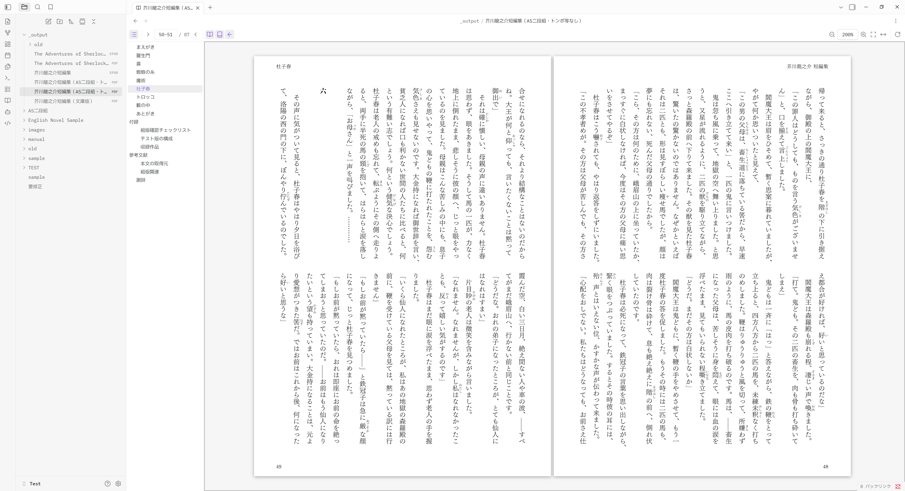
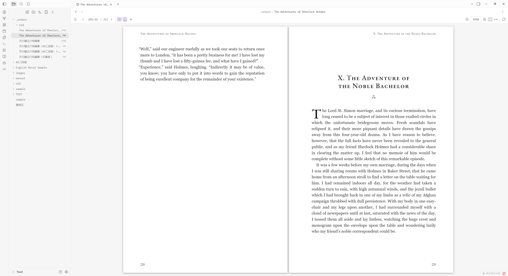

# BookView（Obsidian プラグイン）

English: [README.md](README.md)

縦書き・**右綴じ**の日本語文書を、正しい向きで**見開き表示**できる Obsidian 用の PDF / EPUB ビューアです。
Acrobat Reader の「**表紙を表示**」（1 ページ目だけを単独で表示し、2 ページ目以降を 2-3 / 4-5 … と見開きにする）にも対応しています。

Obsidian 標準の PDF ビューアは 1 ページずつの連続スクロールですが、BookView はページを綴じ方向に合わせて対にして並べ、矢印キーでめくります。
Obsidian がそもそも開けない `.epub` も、縦書き・右開きのまま読めます。



*右綴じの和書。51 ページが左、50 ページが右に並び、左側には PDF の目次を表示しています。*



*同じビューアで左綴じの洋書を開いたところ。綴じ方向は自動で判別されます。いずれも PDF 側の画面で、EPUB には専用のビューアがあります。*

## 機能

### PDF

- **見開き表示 / 単ページ表示** の切り替え
- **右綴じ（縦書き向け）/ 左綴じ** の切り替え
  - 右綴じでは 1 ページ目が左半分、2 ページ目が右・3 ページ目が左…と、実際の和書と同じ並びになります
  - 矢印キーの意味も綴じ方向に追従します（右綴じなら `←` が「次へ」）
- **表紙を表示（Show cover page）**
  - 表紙は単独表示。さらに表紙や最終ページのように片側しかない場合は、中央ではなく綴じ側に寄せて配置します（Acrobat と同じ見え方）
- **綴じ方向の自動判別**
  - `/ViewerPreferences /Direction /R2L` → 右綴じ、`/PageLayout /TwoPageRight` → 見開き＋表紙単独
  - これらを書いている PDF はごく少数なので、指定がなければ本文から判別します。縦書きの日本語・ヘブライ語・アラビア語は右綴じ、いずれでもない文書は左綴じで開きます
  - 判断がつかないもの（横書きの日本語、本文テキストを持たないスキャンPDF）は設定の既定値のままにします
- 全体表示 / 幅に合わせる / 任意倍率のズーム、90 度回転
- 日本語 PDF 向けに pdf.js の CMap を同梱（`UniJIS-UCS2-H`、`90ms-RKSJ-H` などの定義済みエンコーディングを使う PDF もそのまま表示できます）

### EPUB

Obsidian は EPUB を開けず、素の状態ではファイルエクスプローラーにさえ表示されません。BookView はリフロー型と固定レイアウト型の両方を読めます。

- **縦書きの日本語を縦書きのまま**、ルビつきで表示します。組版は本自身のスタイルシートに任せるので、作り手の意図どおりの見た目になります
- **綴じ方向は推測ではなく読み取ります。** spine の `page-progression-direction` から確定的に決まるので、PDF 側のような本文推定は不要です（右開きなら `←` が「次へ」）
- **横書きの本は 2 段組みの見開き表示。**縦書きは本文が全幅を右から左へ流れるため、それ自体が見開きに相当します
- **文字サイズの変更、ページ送り／連続スクロールの切り替え**がいつでもできます
- **組版を好みに合わせられます。**余白・1 行の長さ・行間・段の間隔を調節できます。余白は設定画面だけでなくツールバーにもあり、ドラッグするとその場でページが組み直されます（広いペインでの見え方が横書きと大きく異なる縦書きでとくに効きます）

### 共通

- **目次（アウトライン）パネル**
  - 文書自身が持つ目次を折りたたみ可能なツリーで表示し、クリックでその位置へ移動します
  - いま読んでいる位置に対応する項目がハイライトされます
  - 目次を持たない文書では空になります
- **ファイルごとの記憶。**PDF は綴じ方向・見開き設定・表示中のページ、EPUB は読んでいた位置を EPUB CFI として保存し、次に開いたときに正確に復元します
- **ネットワークアクセスなし。**pdf.js 本体・Worker・CMap・EPUB レンダラはすべて `main.js` に同梱しており、実行時に何も取得しません。EPUB はスクリプトと全ネットワーク通信を禁じる Content-Security-Policy のもとで描画されるため、本の側からコードを実行したり外部へ通信したりはできません

## 操作

Vault 内の PDF をそのまま開けます。既定では `.pdf` を標準ビューアの代わりに BookView が開きますが、設定でオフにすると、ファイルメニューの **Open in BookView** やコマンドパレットから個別に開く形になります。

`.epub` も同じように開けます。Obsidian 自体は EPUB ビューアを持たず、素の状態では `.epub` がファイルエクスプローラーにそもそも表示されません（拡張子を誰も登録していないため）。BookView がこれを登録することで、表示され、開けるようになります。

すでに他のプラグインが `.epub` を扱っている場合は、ワークスペースの読み込み完了後に BookView が引き継ぎ、BookView を無効化すればそのまま返します。どちらにしても失われるものはありません——右クリックメニューの **Open in BookView**（および同名のコマンド）は、拡張子を誰が持っていても BookView で開きます。拡張子は他のプラグインに任せたまま（*Open EPUB files in BookView* をオフ）、必要なときだけ BookView を呼ぶ使い方もできます。

### PDF

| キー | 動作 |
| --- | --- |
| `←` / `→` | 次／前（綴じ方向に応じて反転） |
| `↑` `↓` `PageUp` `PageDown` `Space` | 前／次 |
| `Home` / `End` | 最初／最後 |
| `+` / `-` | 拡大／縮小 |
| `0` | 全体を表示（Fit page） |
| `W` | 幅に合わせる（Fit width） |
| `S` | 見開き表示の切り替え |
| `C` | 表紙を表示の切り替え |
| `R` | 右綴じ／左綴じの切り替え |
| `T` | 目次パネルの開閉 |

- ホイール: ページ送り（横方向のホイールは綴じ方向に従います）。連続スクロール表示のときは通常どおりスクロールします
- `Ctrl` / `Cmd` + ホイール: 文字サイズの変更
- ツールバーの余白ボタンから、本文の上下・左右にあける余白をその場で調節できます（ドラッグ中はページが逐次組み直されます）。設定画面の同じ 2 つのスライダーと同一の設定を書き換えるため、開いているすべての本に反映されます

本は開くのに表示されない、というときは、コマンド **Copy EPUB diagnostics** でレンダラの実測値がクリップボードにコピーされます。不具合報告にそのまま貼れます。

- ホイール: ページ送り（拡大してはみ出しているときは端まで来てから送ります）
- `Ctrl` / `Cmd` + ホイール: 拡大縮小

### EPUB

| キー | 動作 |
| --- | --- |
| `←` / `→` | 次／前（綴じ方向に応じて反転） |
| `↑` `↓` `PageUp` `PageDown` `Space` | 前／次 |
| `+` / `-` | 文字を大きく／小さく |
| `T` | 目次パネルの開閉 |

同じ操作はコマンドパレットからも実行でき（`BookView:` で検索）、ホットキーは Obsidian の設定で割り当てられます。

> プラグイン内の表示（コマンド名・設定画面・ツールチップ）は、コミュニティプラグインの慣習に合わせて英語です。

## インストール

### Obsidian から

**設定 → コミュニティプラグイン → 閲覧** で **BookView** を検索し、インストールして有効化します。

### 手動で

[最新リリース](https://github.com/nonkuri/obsidian-bookview/releases/latest) から `main.js` / `manifest.json` / `styles.css` をダウンロードし、
`<Vault>/.obsidian/plugins/bookview/` に置いて、コミュニティプラグインの一覧で有効化してください。

## 設定

- 新しく開く PDF の既定値（見開き／右綴じ／表紙表示／ズーム）
- PDF 自身のレイアウト指定を優先するか
- 片側だけのページを綴じ側に寄せるか、見開きの間隔、ページの影、ダークテーマでの色反転、描画解像度
- 新しく開く EPUB の既定値（ページ送り／連続スクロール、2 段組み、文字サイズ、1 行の長さ、縦書き時の本文の高さと幅、行間、段の間隔、上下・左右の余白）
- `.pdf` を BookView で開くか（オフにすると Obsidian 標準のビューアのままです）
- `.epub` を BookView で開くか（オフにすると、他のプラグインに任せられます）
- ファイルごとの状態を記憶するか

## 制限

### PDF

- テキストレイヤーがないため、本文の選択・コピー・検索はできません（描画のみ）。
- ページ内に埋め込まれたリンクはクリックできません（注釈を描画していないため）。文書内の移動は目次パネルを使ってください。
- Markdown 内の埋め込み（`![[file.pdf]]`）は Obsidian 標準の描画のままです。
- 埋め込みフォントのない CJK PDF は、環境のフォントで代替描画されます。

### EPUB

- **DRM で保護された本は開けません。** Adobe DRM の EPUB や `.acsm` ファイルの復号は行いません。
- スクリプトを含む EPUB でも、スクリプトは実行されません。Vault の中で本を安全に開くための Content-Security-Policy がこれを禁じており、選択的に許可する手段はありません（意図的な仕様です）。
- ページ分割は CSS の段組みを使うため、長い章はレイアウトに一瞬かかり、特殊なスタイルシートは意図どおりに再現されないことがあります。
- 別ウィンドウ（ポップアウト）では利用できません。レンダラのカスタム要素がメインウィンドウに属しているためです。
- Markdown 内の埋め込み（`![[book.epub]]`）は描画されません。

## 開発

```bash
npm install
npm run dev      # esbuild の watch ビルド
npm run build    # 型チェック + 本番ビルド
```

`npm run deploy -- "C:/path/to/Vault"` でビルド結果を Vault にコピーできます。

### 動作確認用ハーネス

Obsidian を起動せずに、実物のビューをブラウザ上で動かせます。

```bash
npm run test:pdf      # test/sample.pdf を生成（5 ページ・右綴じ指定・目次つき・日本語入り）
npm run test:epub     # test/vertical.epub と test/horizontal.epub を生成
npm run test:build    # test/harness.js をビルド
npm run test:serve    # http://localhost:4321/test/index.html
```

ハーネスの URL に `?epub=vertical.epub` を付けると EPUB ビューが、`?pdf=` で別の PDF が開きます。

`npm test` は、`.pdf` と `.epub` の乗っ取りと返却を——他のプラグインがすでに握っているケースを含めて——Obsidian と同じ挙動のレジストリに対して検証します。

`test/obsidian.ts` は Obsidian API の最小スタブで、プラグイン本体には含まれません。

## ライセンス

MIT（[LICENSE](LICENSE)）。pdf.js（Apache License 2.0）と foliate-js（MIT、zip.js と fflate を含む）を同梱しています。詳細は [THIRD_PARTY_NOTICES.md](THIRD_PARTY_NOTICES.md) を参照してください。
